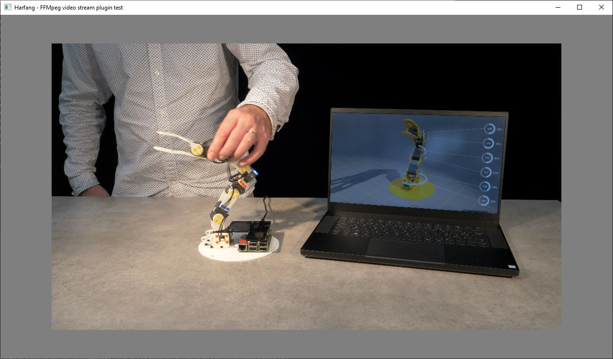

# FFmpeg video plugin

## Prerequisites

### ● Harfang C++ SDK
The Harfang C++ SDK is only required to build the sample test program.

### ● FFmpeg libraries
You can either use the binary packages from the FFmpeg website or any package manager (apt, pacman, homebrew, chocolatey...).

## Build
Both plugin and sample can be built using CMake and any recent C/C++ compiler (gcc, clang, msvc...).

### ● FFmpeg plugin
To build the plugin, go to the source directory and create a build directory where CMake configuration will be performed.

On Windows, you must defined `FFMPEG_ROOT`. This variable contains the path to the FFmpeg libraries and header files.

```
mkdir build
cd build
cmake .. \
    -DFFMPEG_ROOT=<path where FFmpeg sdk> \
    -DCMAKE_INSTALL_PREFIX=<plugin install path>
```

On Linux, do not forget to specify `CMAKE_BUILD_TYPE` or the install will fail. If FFmpeg was installed using the system package manager, there is no need to specify `FFMPEG_ROOT`.
```
cmake .. \
    -DCMAKE_BUILD_TYPE=Release \
    -DCMAKE_INSTALL_PREFIX=<plugin install path>
```

### ● Test program
The sample program requires Harfang C++ SDK, Asset compiler (assetc) and the FFmpeg plugin (or any video stream plugin).

```
cmake .. -DHG_CPPSDK_PATH=<path to harfang cpp sdk> \
         -DHG_ASSETC_PATH=<path to assetc> \
         -DHG_VIDEO_STREAM_PLUGIN=<plugin filepath> \
         -DCMAKE_INSTALL_PREFIX=<install path>
```

Once the build is complete, the install directory should contain all the required shared libraries and an executable binary named `hg_vid_play`.

```
hg_vid_play movie.mp4
```



### ● Lua sample
The test directory also contains a lua script ([main.lua](./test/main.lua)). This script maps a video stream onto a spinning cube. 
Note that you need the Harfang 3D lua 5.3 to run it.

